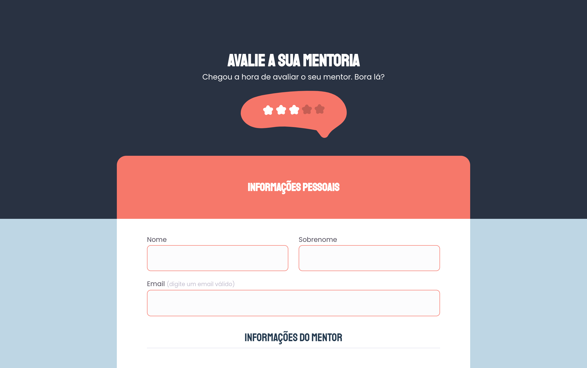

  

## 🚀 Tecnologias

Esse projeto foi desenvolvido com as seguintes tecnologias:

- [HTML](https://developer.mozilla.org/pt-BR/docs/Web/HTML)
- [CSS](https://developer.mozilla.org/pt-BR/docs/Web/CSS)

## 💻 Projeto

O projeto Avalie a sua mentoria foi um desafio proposto para treinar a prática em criar um formulário nele você pode avaliar sua mentoria e agendar o próximo horário com um mentor , ele foi elaborado na aula do programa Explorer da Rocketseat.

- [Página](https://igorsilvam.github.io/Avalie_a_sua_mentoria/)

## 🔖 Layout

No link abaixo você encontra o layout do projeto web. Lembrando que você precisa ter uma conta no [Figma](http://figma.com/) para acessá-lo.

- [Layout Web](<https://www.figma.com/file/Gx7MpC4egE5QMr5Ml81TPZ/Stage-03---Formul%C3%A1rio-avan%C3%A7ado-(Copy)?node-id=10%3A17>)
